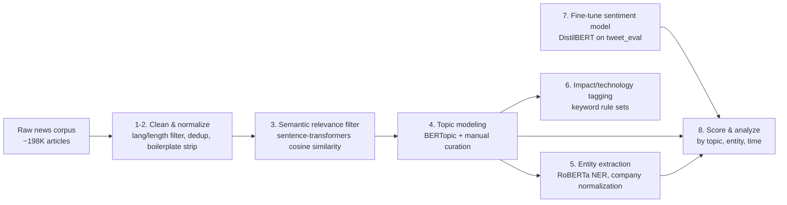

# AI in the News — Media Sentiment & Topic Pipeline

An end-to-end NLP pipeline that turns ~200K raw English-language news articles
into a structured view of how the media covers AI's impact on business and
industry: what topics get covered, which companies get named, what kind of
impact (automation, risk, productivity...) gets attributed to AI, and whether
the tone of coverage is positive, neutral, or negative — and how that's
shifted over four years.

**[→ Open the interactive dashboard](https://yichun-zhang-zyc.github.io/ai-news-sentiment-pipeline/)** (topic breakdown, sentiment over time, impact/technology mix by industry)

## Pipeline



| Stage | Script | What it does |
|---|---|---|
| 1 | [`pipeline/01_clean_raw_data.py`](pipeline/01_clean_raw_data.py) | Load the public corpus, keep English articles in a sane length range, normalize text, dedupe by URL |
| 2 | [`pipeline/02_light_regex_clean.py`](pipeline/02_light_regex_clean.py) | Strip emails, phone numbers, newsletter/cookie boilerplate |
| 3 | [`pipeline/03_semantic_filter.py`](pipeline/03_semantic_filter.py) | Keep the 70% of articles most semantically similar to a hand-written "AI business impact" query embedding (unsupervised, no labeling) |
| 4 | [`pipeline/04_topic_modeling.py`](pipeline/04_topic_modeling.py) | BERTopic (UMAP + HDBSCAN + custom stopwords) over the relevant corpus, then manual curation of raw clusters into 8 industry-labeled topics |
| 5 | [`pipeline/05_entity_extraction.py`](pipeline/05_entity_extraction.py) | RoBERTa-large NER to pull organization mentions, then normalize company names (strip Inc/Corp/Ltd suffixes) |
| 6 | [`pipeline/06_impact_and_tech_tagging.py`](pipeline/06_impact_and_tech_tagging.py) | Rule-based tagging of *impact mode* (automation, augmentation, cost reduction, productivity, risk, workflow redesign) and *technology type* (LLM, computer vision, chatbot, ...) per article |
| 7 | [`pipeline/07_train_sentiment_model.py`](pipeline/07_train_sentiment_model.py) | Fine-tune `distilbert-base-uncased` for 3-class sentiment (negative/neutral/positive) on `tweet_eval` |
| 8 | [`pipeline/08_score_and_analyze_sentiment.py`](pipeline/08_score_and_analyze_sentiment.py) | Score every article with the fine-tuned model, then aggregate sentiment by topic, by company, and by month |

The original exploratory work is preserved in [`notebooks/`](notebooks/) (Colab
notebooks, path names still reference Google Drive); `pipeline/` is the
refactored, reproducible version that runs against a local `PROJECT_ROOT`.

## Results

- **198K → 139K → 4,561** articles survive language/length filtering, then
  semantic relevance filtering, then topic curation (dropping newswire-template
  and geography-noise clusters).
- **8 final topics**, spanning Healthcare, AI Infrastructure/Chips, Enterprise
  IT, Cybersecurity, Finance, Government/Regulation, Consumer Electronics, and
  Media — see [`data/topic_summary_final.csv`](data/topic_summary_final.csv)
  for keywords and representative articles per topic.
- Coverage spans **Jan 2022 – Feb 2026**; the dashboard's sentiment-over-time
  chart shows the monthly positive/neutral/negative split across that window.
- Industry-level breakdowns of *what AI is being used for* (impact mode) and
  *what kind of AI* (technology) are in
  [`data/industry_impact_counts.csv`](data/industry_impact_counts.csv) and
  [`data/industry_technology_counts.csv`](data/industry_technology_counts.csv).

## Dashboard

`web/index.html` is a static, dependency-light dashboard (Chart.js via CDN)
that reads the small aggregate JSON files in `web/data/` — no server-side
code, no large model/data files required. Serve it locally with:

```bash
cd web && python3 -m http.server 8000
# open http://localhost:8000
```

or enable GitHub Pages on this repo pointed at `/web`.

## Running the pipeline

```bash
pip install -r requirements.txt
cd pipeline
python 01_clean_raw_data.py
python 02_light_regex_clean.py
python 03_semantic_filter.py
python 04_topic_modeling.py
python 05_entity_extraction.py
python 06_impact_and_tech_tagging.py
python 07_train_sentiment_model.py   # or point MODEL_DIR at a pre-trained checkpoint
python 08_score_and_analyze_sentiment.py
```

Each stage reads/writes under `artifacts/` (set `PROJECT_ROOT` to change the
base directory). Stages 4, 5, and 7 are GPU-recommended; everything else runs
fine on CPU. Raw article data and the trained model weights are intentionally
**not** committed to this repo — stage 1 pulls from a public GCS bucket, and
stage 7 reproduces the sentiment model from a public HF dataset.

## Repo structure

```
pipeline/     clean, reproducible pipeline scripts (this is the code to read)
notebooks/    original Colab exploration (unrefactored, for provenance)
data/         small reference/aggregate outputs used by the pipeline and dashboard
web/          static dashboard (index.html + app.js + aggregate JSON)
```

## Notes & limitations

- Sentiment is scored by a small fine-tuned DistilBERT (trained on tweets,
  not news), so treat it as a directional signal rather than ground truth.
- Impact-mode and technology tagging are keyword/phrase-based, not model-based
  — precise but not exhaustive; articles using different phrasing for the same
  concept can be missed.
- Topic curation (dropping noise clusters, assigning industry labels) was done
  manually after inspecting BERTopic's raw output; see
  [`data/topic_labels_manual.csv`](data/topic_labels_manual.csv) for the full mapping.
